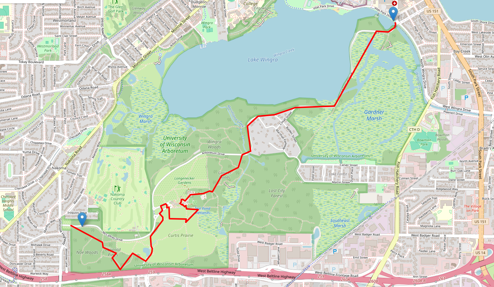

# Fantasy Trail Stitcher

A route-planning tool that generates real, walkable routes matching a target
distance, built around a custom distance-constrained pathfinding algorithm
over OpenStreetMap trail and road data.

The original idea was mapping fictional journey distances (Shire to Mordor,
Winterfell to King's Landing) onto real-world walks. That framing raised
copyright concerns around using named fictional IP, so the project focuses
on the underlying mechanic: given a start point, an end point, and a target
distance, find a real route that matches, preferring trails over roads
where they exist.

## What it does

Given two points and a target distance, the system searches a real trail
and road network (pulled from OpenStreetMap) for a walkable route whose
length is close to the target, favoring trail-type paths over roads
without ever ruling roads out, since some road-walking is often necessary
to connect disconnected trail systems.

## Example

A route generated near the UW-Madison Arboretum, matching an 8,000m
target distance:

The route threads through Curtis Prairie, Longenecker Gardens, and
Gallistrom Woods before following the shoreline of Lake Wingra to
Vilas Park, mostly on real trail (footway/path), not sidewalks.

## Architecture

- **Data layer**: OSMnx pulls walkable network data from OpenStreetMap,
  cached locally as GraphML so the app never queries OSM live.
- **Pathfinding**: a custom randomized DFS with backtracking, guided by a
  Dijkstra-precomputed feasibility bound, wrapped in bounded random
  restarts. See "Algorithm design" below for why this exists.
- **API**: FastAPI loads the graph once at startup and exposes `/route`.
- **Frontend**: a single-page Leaflet map; click to set start/end points,
  enter a target distance, and the matched route is drawn live.

## Algorithm design: why this isn't just shortest-path

Finding *a* path between two points is trivial (Dijkstra). Finding a path
whose length matches a *target* distance is a different, harder problem,
and the path taken here to solve it is the core technical content of this
project.

**Attempt 1: k-shortest-paths.** Networkx's `shortest_simple_paths` (Yen's
algorithm) generates simple paths between two points in increasing length
order, so trying candidates until one matches the target seemed natural.
In testing, this plateaued fast: on real park trail networks, the first 50
candidate paths were barely longer than the shortest path itself. Yen's
algorithm generates alternates by taking small local deviations from the
shortest path, so reaching a path meaningfully longer than the shortest one
can require checking an impractically large number of candidates.

**Attempt 2: randomized DFS with backtracking.** Instead of enumerating
near-shortest paths, build a path incrementally: at each node, look at
unvisited neighbors, use a Dijkstra-precomputed "distance remaining to the
end" value to prune any neighbor that could never reach the destination
within the distance budget, and pick randomly among what's left. On
dead-ends, backtrack rather than discard the whole attempt. This performed
far better and could reach target distances several times the direct
shortest path.

**A hard limit, and why it's not a bug.** Even with backtracking, very
long targets between a specific pair of points sometimes failed outright.
Testing showed this wasn't fixable by pulling more map data: a much larger
regional graph (338K nodes vs. 137K) produced the same ceiling for the
same point pair. The reason is structural: the simple-path constraint (no
revisiting a node) means the longest possible route between two fixed
points isn't bounded by how much trail exists overall, it's the "longest
simple path between two nodes" problem, which is NP-hard in general. The
fix that worked was **bounded random restarts**: many short search attempts
beat one long one, since an early unlucky random choice can doom an entire
attempt.

**Trail preference without breaking feasibility.** Real OSM data pulled
for a 50-mile radius around a mid-size US city is roughly 83% road and
under 5% actual trail (path/track/bridleway), so an unweighted search
overwhelmingly finds sidewalk- and road-heavy routes. A hard trail-only
restriction was tested but rejected: trail data alone is highly
fragmented (over 3,000 disconnected components in the test region, the
largest only ~300 nodes), far too sparse to route long distances on its
own. The working solution penalizes road edges in the *selection* step
only, while keeping the *feasibility* check (can this route reach the
end within budget) based on true physical distance. Mixing the penalty
into feasibility was tried first and caused the search to falsely
conclude destinations were unreachable; separating "is this reachable"
from "which neighbor do we prefer" fixed it.

## Known limitations

- Achievable route length for a given point pair is bounded by local
  trail connectivity, not total map size; very long targets may fail even
  with restarts.
- Route quality (trail vs. road percentage) depends heavily on how much
  real trail exists near the chosen start/end points; urban-only requests
  will be sidewalk-heavy by nature of the underlying data.
- Data is pre-fetched and cached per region rather than queried live, since
  the public OSM Overpass API cannot reliably serve large-radius requests
  in a single call (confirmed via testing: a 50-mile single-request pull
  timed out after 10 minutes). The current region (Madison, WI, 50-mile
  radius) was built from 25 overlapping tiled requests merged into one
  graph.

## Stack

Python, OSMnx, NetworkX, FastAPI, Leaflet.